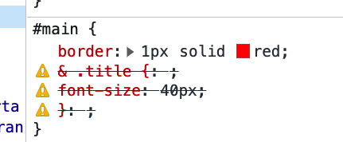

Webpack4 Config "postcss-preset-env" Demo
======================================

有错误, nest css不能解析：



我专门试了nesting plugin，可以正常处理：
https://github.com/freewind-demos/typescript-webpack4-postcss-loader-nesting-plugin-demo

我觉得这里有问题可能的原因是，在这里使用的是webpack/postcss-loader旧版本，
1. postcss-preset-env本身与它们不能正常工作
2. postcss-preset-env中包含的某个插件与它们不能正常工作

先不管了

```
npm install
npm run demo
```
